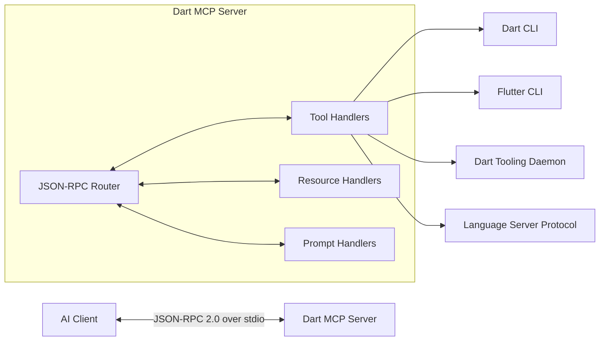
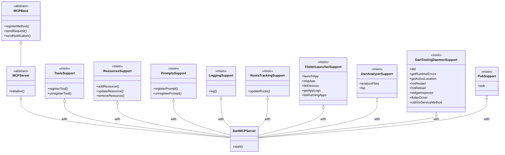
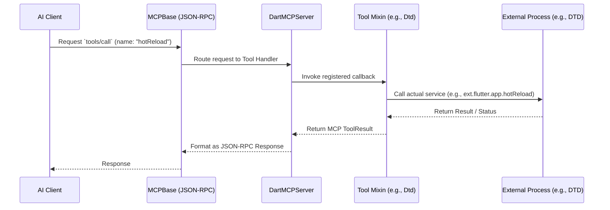

# Architecture of Dart MCP Server

This document outlines the high-level architecture of the `dart_mcp_server` and its underlying core library `dart_mcp`.

## High-Level Overview

The Dart MCP Server is an implementation of the Model Context Protocol (MCP). It acts as a bridge between an AI-assistant client (like the Gemini CLI or an IDE plugin) and the Dart/Flutter development environment.

## Package Structure

The project is split into two primary packages:

1. **`dart_mcp`**: The foundational library implementing the MCP specification. It provides base classes for both Clients and Servers, defining the API types, JSON-RPC communication, and standard MCP capabilities (Tools, Resources, Prompts, etc.) via mixins.
2. **`dart_mcp_server`**: The concrete implementation of a server tailored for Dart and Flutter. It extends the base `MCPServer` and implements specific tools (like `hotReload`, `analyzeFiles`, `launchApp`) by interacting with the Dart CLI, Flutter CLI, and the Dart Tooling Daemon (DTD).

## Core Class Architecture & Mixins

The server uses a heavily mixin-based architecture. This allows for clean separation of concerns, where each MCP capability and each set of tools can be developed and maintained independently.

### `dart_mcp` Mixins

The foundational package provides mixins corresponding to MCP specification features:
- **`ToolsSupport`**: Allows registering tools that the LLM can call.
- **`ResourcesSupport`**: Manages exposing local data and files to the client as resources.
- **`PromptsSupport`**: Provides a list of pre-defined prompts to the client.
- **`LoggingSupport`**: Structured server-to-client log messages.
- **`RootsTrackingSupport`**: Tracks the client's project roots to provide workspace context to tools.

### `dart_mcp_server` Mixins

The concrete server composes tools by mixing in specialized feature sets:
- **`FlutterLauncherSupport`**: App lifecycle management (`launchApp`, `stopApp`, `listDevices`).
- **`DartAnalyzerSupport`**: Static analysis of Dart code (`analyzeFiles`).
- **`DartToolingDaemonSupport`**: Dart Tooling Daemon integration for hot reload, hot restart, and widget tree inspection.
- **`PubSupport`**: Package management tools.
- **`PubDevSearchSupport`**: Querying packages from pub.dev.
- **`AnalyticsSupport`**: Telemetry and usage tracking.

## Deep Dive: Key Tooling Subsystems

### Dart Tooling Daemon (DTD) Integration

The `DartToolingDaemonSupport` mixin is responsible for bridging the MCP server with the [Dart Tooling Daemon](https://pub.dev/packages/dtd). DTD serves as a central hub for communication between various Dart tools, IDEs, and running Dart/Flutter applications.

**Auto-Discovery and Connection:**
When the MCP server connects to a DTD instance, it subscribes to DTD service events (like `ConnectedAppServiceConstants.vmServiceRegistered`) and Editor streams. This allows the MCP server to automatically discover any Dart or Flutter apps connected to that DTD instance, regardless of whether they were launched by an IDE, the CLI, or the MCP server itself. The server automatically establishes VM Service connections to these newly discovered apps and tracks them.

**Supported Features:**
- **App Lifecycle & Execution:** Tools to trigger `hotReload` and `hotRestart` on connected applications.
- **Diagnostics:** The `getRuntimeErrors` tool monitors the VM service error stream, capturing and providing access to recent runtime exceptions for the apps.
- **Widget Inspector:** The `widgetInspector` tool interacts with the `ext.flutter.inspector` service extension to fetch the widget tree, select widgets, and change the selection mode.
- **Flutter Driver:** Enables running Flutter Driver commands against connected applications for UI automation.
- **Direct VM Service access:** The `callVmServiceMethod` tool allows making arbitrary, raw RPC calls to the VM service of a connected app.

### Analyzer Integration

The `DartAnalyzerSupport` mixin integrates the Dart Language Server Protocol (LSP) into the MCP server. Rather than running a one-off analysis pass, it starts and manages a persistent `dart language-server` process.

**Persistent Workspace Analysis:**
When the client's project workspace roots change (tracked via the `RootsTrackingSupport` mixin), the analyzer mixin dynamically updates the LSP workspace folders. The server remains active in the background, listening for file changes and diagnostics.

**Supported Features:**
- **Diagnostics & Quick Fixes:** The `analyzeFiles` tool queries the LSP server for current workspace diagnostics. It can also request the LSP server to apply quick fixes (`dart.edit.fixAllInWorkspace`), which the MCP server translates into filesystem edits via `workspace/applyEdit` events from the language server.
- **Language Intelligence:** The `lsp` tool exposes deep IDE-like capabilities, including:
  - `hover`: Provides documentation and type information for a specific position in the code.
  - `signatureHelp`: Returns parameter information for function calls.
  - `resolveWorkspaceSymbol`: Enables searching for classes, methods, and variables across the entire workspace.

## Request Lifecycle

When a client wants to invoke a tool, the request flows through the base communication layer into the specific mixin that registered the tool.

## Transport Mechanism

By default, the `dart_mcp_server` communicates with clients over standard input/output (`stdio`).
The `lib/stdio.dart` utility in `dart_mcp` creates a `StreamChannel` wrapping `stdin` and `stdout`, which the `MCPBase` uses for JSON-RPC 2.0 message passing. This allows the server to be seamlessly spawned as a subprocess by clients like the Gemini CLI or IDE extensions.
