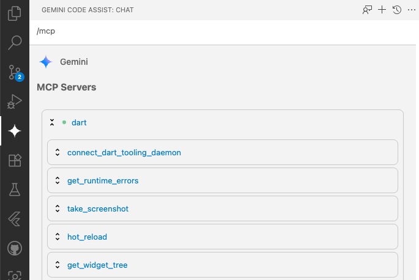

The Dart Tooling MCP Server exposes Dart and Flutter development tool actions to compatible AI-assistant clients.

## Status

WIP. This package is still experimental and is likely to evolve quickly.

<!-- Note: since many of our tools require access to the Dart Tooling Daemon, we may want
to be cautious about recommending tools where access to the Dart Tooling Daemon does not exist. -->

## Set up your MCP client

The Dart MCP server can work with any MCP client that supports standard I/O (stdio) as the
transport medium. To access all the features of the Dart MCP server, an MCP client must support
[Tools](https://modelcontextprotocol.io/docs/concepts/tools) and
[Resources](https://modelcontextprotocol.io/docs/concepts/resources). For the best development
experience with the Dart MCP server, an MCP client should also support
[Roots](https://modelcontextprotocol.io/docs/concepts/roots). Here are specific instructions for
some popular tools:

### Gemini CLI

To configure the [Gemini CLI](https://github.com/google-gemini/gemini-cli) to use the Dart MCP
server, edit the file `.gemini/settings.json` file in your local project (configuration will only
apply to this project) or edit the global `~/.gemini/settings.json` file in your home directory
(configuration will apply for all projects).

```json
{
  "mcpServers": {
    "dart": {
      "command": "dart",
      "args": [
        "mcp-server",
        "--experimental-mcp-server", // Can be removed for Dart 3.9.0 or later.
      ]
    }
  }
}
```

For more information, see the official Gemini CLI documentation for
[setting up MCP servers](https://github.com/google-gemini/gemini-cli/blob/main/docs/tools/mcp-server.md#how-to-set-up-your-mcp-server).

### Gemini Code Assist in VS Code

> Note: this currently requires the "Insiders" channel. Follow
[instructions](https://developers.google.com/gemini-code-assist/docs/use-agentic-chat-pair-programmer#before-you-begin)
to enable this build.

[Gemini Code Assist](https://codeassist.google/)'s
[Agent mode](https://developers.google.com/gemini-code-assist/docs/use-agentic-chat-pair-programmer) integrates the Gemini CLI to provide a powerful
AI agent directly in your IDE. To configure Gemini Code Assist to use the Dart MCP
server, follow the instructions to [configure the Gemini](#gemini-cli) CLI above.

You can verify the MCP server has been configured properly by typing `/mcp` in the chat window in
Agent mode.



For more information see the official Gemini Code Assist documentation for
[using agent mode](https://developers.google.com/gemini-code-assist/docs/use-agentic-chat-pair-programmer#before-you-begin).

<!-- ### Android Studio -->
<!-- TODO(https://github.com/dart-lang/ai/issues/199): once we are confident that the
Dart MCP server will work well with Android Studio's MCP support, add documentation here
for configuring the server in Android Studio. -->

### Cursor

[](https://cursor.com/install-mcp?name=dart_tooling&config=eyJ0eXBlIjoic3RkaW8iLCJjb21tYW5kIjoiZGFydCBtY3Atc2VydmVyIC0tZXhwZXJpbWVudGFsLW1jcC1zZXJ2ZXIgLS1mb3JjZS1yb290cy1mYWxsYmFjayJ9)

The easiest way to configure the Dart MCP server with Cursor is by clicking the "Add to Cursor"
button above. Optionally, you can also configure the server manually by editing the
`.cursor/mcp.json` file in your local project (configuration will only apply to this project) or
editing the global `~/.cursor/mcp.json` file in your home directory (configuration will apply for
all projects).

```json
{
  "mcpServers": {
    "dart": {
      "command": "dart",
      "args": [
        "mcp-server",
        "--experimental-mcp-server", // Can be removed for Dart 3.9.0 or later
        "--force-roots-fallback" // Workaround for a Cursor issue with Roots support
      ]
    }
  }
}
```

For more information, see the official Cursor documentation for
[installing MCP servers](https://docs.cursor.com/context/model-context-protocol#installing-mcp-servers).

### Visual Studio Code Copilot
<!-- TODO: update these docs to mention the automatic configuration provided by the Dart
VS Code extension. -->

To configure the Dart MCP server for a single project, edit the `.vscode/mcp.json`
file in your workspace:

```json
"servers": {
  "dart": {
    "type": "stdio",
    "command": "dart",
    "args": [
      "mcp-server",
      "--experimental-mcp-server", // Can be removed for Dart 3.9.0 or later
    ]
  }
}
```

To make the Dart MCP server available in every project you open, edit your
VS Code user settings:

```json
"mcp": {
  "servers": {
    "dart": {
      "type": "stdio",
      "command": "dart",
      "args": [
        "mcp-server",
        "--experimental-mcp-server", // Can be removed for Dart 3.9.0 or later
      ]
    }
  }
}
```

For more information, see the official VS Code documentation for
[enabling MCP support](https://code.visualstudio.com/docs/copilot/chat/mcp-servers#_enable-mcp-support-in-vs-code).

## Tools

| Tool Name | Feature Group | Description |
| --- | --- | --- |
| `analyze_files` | `static analysis` | Analyzes the entire project for errors. |
| `signature_help` | `static_analysis` | Gets signature information for usage at a given cursor position. |
| `hover` | `static_analysis` | Gets the hover information for a given cursor position. |
| `resolve_workspace_symbol` | `static analysis` | Look up a symbol or symbols in all workspaces by name. |
| `dart_fix` | `static tool` | Runs `dart fix --apply` for the given project roots. |
| `dart_format` | `static tool` | Runs `dart format .` for the given project roots. |
| `pub` | `static tool` | Runs a `dart pub` command for the given project roots. |
| `pub_dev_search` | `package search` | Searches pub.dev for packages relevant to a given search query. |
| `get_runtime_errors` | `runtime analysis` | Retrieves the list of runtime errors that have occurred in the active Dart or Flutter application. |
| `take_screenshot` | `runtime analysis` | Takes a screenshot of the active Flutter application in its current state. |
| `get_widget_tree` | `runtime analysis` | Retrieves the widget tree from the active Flutter application. |
| `get_selected_widget` | `runtime analysis` | Retrieves the selected widget from the active Flutter application. |
| `hot_reload` | `runtime tool` | Performs a hot reload of the active Flutter application. |
| `connect_dart_tooling_daemon`* | `configuration` | Connects to the locally running Dart Tooling Daemon. |
| `get_active_location` | `editor` | Gets the active cursor position in the connected editor (if available). |
| `run_tests` | `static tool` | Runs tests for the given project roots. |
| `create_project` | `static tool` | Creates a new Dart or Flutter project. |

> *Experimental: may be removed.

## Usage

This server only supports the STDIO transport mechanism and runs locally on
your machine. Many of the tools require that your MCP client has `roots`
support, and usage of the tools is scoped to only these directories.

If you are using a client that claims it supports roots but does not actually
set them, pass `--force-roots-fallback` which will instead enable tools for
managing the roots.

### Running from the SDK

For most users, you should just use the `dart mcp-server` command. For now you
also need to provide `--experimental-mcp-server` in order for the command to
succeed.

### Running a local checkout

The server entrypoint lives at `bin/main.dart`, and can be ran however you
choose, but the easiest way is to run it as a globally activated package.

You can globally activate it from path for local development:

```sh
dart pub global activate -s path .
```

Or from git:

```sh
dart pub global activate -s git https://github.com/dart-lang/ai.git \
  --git-path pkgs/dart_mcp_server/
```

And then, assuming the pub cache bin dir is [on your PATH][set-up-path], the
`dart_mcp_server` command will run it, and recompile as necessary.

[set-up-path]: https://dart.dev/tools/pub/cmd/pub-global#running-a-script-from-your-path

**Note:**: For some clients, depending on how they launch the MCP server and how
tolerant they are, you may need to compile it to exe to avoid extra output on
stdout:

```sh
dart compile exe bin/main.dart
```

And then provide the path to the executable instead of using the globally
activated `dart_mcp_server` command.

### With the example WorkflowBot

After compiling the binary, you can run the example [workflow bot][workflow_bot]
to interact with the server. Note that the workflow bot sets the current
directory as the root directory, so if your server expects a certain root
directory you will want to run the command below from there (and alter the
paths as necessary). For example, you may want to run this command from the
directory of the app you wish to test the server against.

[workflow_bot]: https://github.com/dart-lang/ai/tree/main/mcp_examples/bin/workflow_bot


```dart
dart pub add "dart_mcp_examples:{git: {url: https://github.com/dart-lang/ai.git, path: mcp_examples}}"
dart run dart_mcp_examples:workflow_client --server dart_mcp_server
```

### With Cursor

The following button should work for most users:

[](https://cursor.com/install-mcp?name=dart_tooling&config=eyJ0eXBlIjoic3RkaW8iLCJjb21tYW5kIjoiZGFydCBtY3Atc2VydmVyIC0tZXhwZXJpbWVudGFsLW1jcC1zZXJ2ZXIgLS1mb3JjZS1yb290cy1mYWxsYmFjayJ9)

To manually install it, go to Cursor -> Settings -> Cursor Settings and select "MCP".

Then, click "Add new global MCP server".

If you are directly editing your mcp.json file, it should look like this:

```json
{
  "mcpServers": {
    "dart_mcp": {
      "command": "dart",
      "args": [
        "mcp-server",
        "--experimental-mcp-server",
        "--force-roots-fallback"
      ]
    }
  }
}
```

Each time you make changes to the server, you'll need to restart the server on
the MCP configuration page or reload the Cursor window (Developer: Reload Window
from the Command Palette) to see the changes.

## Development

For local development, use the [MCP Inspector](https://modelcontextprotocol.io/docs/tools/inspector).

1. Run the inspector with no arguments:
    ```shell
    npx @modelcontextprotocol/inspector
    ```

2. Open the MCP Inspector in the browser and enter `dart_mcp_server` in
the "Command" field.

3. Click "Connect" to connect to the server and debug using the MCP Inspector.
