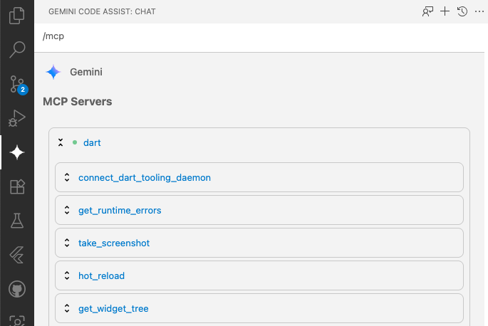

The Dart Tooling MCP Server exposes Dart and Flutter development tool actions to compatible AI-assistant clients.

## Status

WIP. This package is still experimental and is likely to evolve quickly.

## Set up your MCP client

> Note: all of the following set up instructions require Dart 3.9.0-163.0.dev or later.

<!-- Note: since many of our tools require access to the Dart Tooling Daemon, we may want
to be cautious about recommending tools where access to the Dart Tooling Daemon does not exist. -->

The Dart MCP server can work with any MCP client that supports standard I/O (stdio) as the
transport medium. To access all the features of the Dart MCP server, an MCP client must support
[Tools](https://modelcontextprotocol.io/docs/concepts/tools) and
[Resources](https://modelcontextprotocol.io/docs/concepts/resources). For the best development
experience with the Dart MCP server, an MCP client should also support
[Roots](https://modelcontextprotocol.io/docs/concepts/roots).

If you are using a client that claims it supports roots but does not actually
set them, pass `--force-roots-fallback` which will instead enable tools for
managing the roots.

Here are specific instructions for some popular tools:

### Gemini CLI

To configure the [Gemini CLI](https://github.com/google-gemini/gemini-cli) to use the Dart MCP
server, edit the `.gemini/settings.json` file in your local project (configuration will only
apply to this project) or edit the global `~/.gemini/settings.json` file in your home directory
(configuration will apply for all projects).

```json
{
  "mcpServers": {
    "dart": {
      "command": "dart",
      "args": [
        "mcp-server",
        "--experimental-mcp-server", // Can be removed for Dart 3.9.0 or later.
      ]
    }
  }
}
```

For more information, see the official Gemini CLI documentation for
[setting up MCP servers](https://github.com/google-gemini/gemini-cli/blob/main/docs/tools/mcp-server.md#how-to-set-up-your-mcp-server).

### Gemini Code Assist in VS Code

> Note: this currently requires the "Insiders" channel. Follow
[instructions](https://developers.google.com/gemini-code-assist/docs/use-agentic-chat-pair-programmer#before-you-begin)
to enable this build.

[Gemini Code Assist](https://codeassist.google/)'s
[Agent mode](https://developers.google.com/gemini-code-assist/docs/use-agentic-chat-pair-programmer) integrates the Gemini CLI to provide a powerful
AI agent directly in your IDE. To configure Gemini Code Assist to use the Dart MCP
server, follow the instructions to [configure the Gemini](#gemini-cli) CLI above.

You can verify the MCP server has been configured properly by typing `/mcp` in the chat window in Agent mode.



For more information see the official Gemini Code Assist documentation for
[using agent mode](https://developers.google.com/gemini-code-assist/docs/use-agentic-chat-pair-programmer#before-you-begin).

<!-- ### Android Studio -->
<!-- TODO(https://github.com/dart-lang/ai/issues/199): once we are confident that the
Dart MCP server will work well with Android Studio's MCP support, add documentation here
for configuring the server in Android Studio. -->

### Cursor

[](cursor://anysphere.cursor-deeplink/mcp/install?name=dart&config=eyJ0eXBlIjoic3RkaW8iLCJjb21tYW5kIjoiZGFydCBtY3Atc2VydmVyIC0tZXhwZXJpbWVudGFsLW1jcC1zZXJ2ZXIgLS1mb3JjZS1yb290cy1mYWxsYmFjayJ9)

The easiest way to configure the Dart MCP server with Cursor is by clicking the "Add to Cursor"
button above.

Alternatively, you can configure the server manually. Go to **Cursor -> Settings -> Cursor Settings > Tools & Integrations**, and then click **"Add Custom MCP"** or **"New MCP Server"**
depending on whether you already have other MCP servers configured. Edit the `.cursor/mcp.json` file in your local project (configuration will only apply to this project) or
edit the global `~/.cursor/mcp.json` file in your home directory (configuration will apply for
all projects) to configure the Dart MCP server:

```json
{
  "mcpServers": {
    "dart": {
      "command": "dart",
      "args": [
        "mcp-server",
        "--experimental-mcp-server", // Can be removed for Dart 3.9.0 or later
        "--force-roots-fallback" // Workaround for a Cursor issue with Roots support
      ]
    }
  }
}
```

For more information, see the official Cursor documentation for
[installing MCP servers](https://docs.cursor.com/context/model-context-protocol#installing-mcp-servers).

### GitHub Copilot in VS Code

<!-- TODO: once the dart.mcpServer setting is not hidden, we may be able
to provide a deep link to the Dart Extension Settings UI for users to
enable the server. See docs: https://code.visualstudio.com/docs/configure/settings#_settings-editor.
This may be preferable to adding the deep link button to VS Code's mcp settings. -->

> Note: requires Dart-Code VS Code extension v3.114 or later.

To configure the Dart MCP server with Copilot or any other AI agent that supports the
[VS Code MCP API](https://code.visualstudio.com/api/extension-guides/mcp), add the following
to your VS Code user settings (Command Palette > **Preferences: Open User Settings (JSON)**):
```json
"dart.mcpServer": true
```

By adding this setting, the Dart VS Code extension will register the Dart MCP Server
configuration with VS Code so that you don't have to manually configure the server.
Copilot will then automatically configure the Dart MCP server on your behalf. This is
a global setting. If you'd like the setting to apply only to a specific workspace, add
the entry to your workspace settings (Command Palette > **Preferences: Open Workspace Settings (JSON)**)
instead.

For more information, see the official VS Code documentation for
[enabling MCP support](https://code.visualstudio.com/docs/copilot/chat/mcp-servers#_enable-mcp-support-in-vs-code).

## Tools

<!-- run 'dart tool/update_readme.dart' to update -->

<!-- generated -->

| Tool Name | Title | Description | Categories | Enabled |
| --- | --- | --- | --- | --- |
| `add_roots` | Add roots | Adds one or more project roots. Tools are only allowed to run under these roots, so you must call this function before passing any roots to any other tools. | None | Yes |
| `analyze_files` | Analyze projects | Analyzes specific paths, or the entire project, for errors. | analysis | Yes |
| `create_project` | Create project | Creates a new Dart or Flutter project. | cli | No |
| `dart_fix` | Dart fix | Runs `dart fix --apply` for the given project roots. | cli | No |
| `dart_format` | Dart format | Runs `dart format .` for the given project roots. | cli | No |
| `dtd` | Dart Tooling Daemon | Connects to, disconnects from, or lists apps connected to the Dart Tooling Daemon. | dart_tooling_daemon | Yes |
| `flutter_driver_command` | Flutter Driver | Run a flutter driver command | flutter_driver | Yes |
| `get_active_location` | Get Active Editor Location | Retrieves the current active location (e.g., cursor position) in the connected editor. Requires an active DTD connection. | dart_tooling_daemon | No |
| `get_app_logs` |  | Returns the collected logs for a given flutter run process id. Can only retrieve logs started by the launch_app tool. | flutter | Yes |
| `get_runtime_errors` | Get runtime errors | Retrieves the most recent runtime errors that have occurred in the active Dart or Flutter application. Requires an active DTD connection. | dart_tooling_daemon | Yes |
| `hot_reload` | Hot reload | Performs a hot reload of the active Flutter application. This will apply the latest code changes to the running application, while maintaining application state.  Reload will not update const definitions of global values. Requires an active DTD connection. | flutter | Yes |
| `hot_restart` | Hot restart | Performs a hot restart of the active Flutter application. This applies the latest code changes to the running application, including changes to global const values, while resetting application state. Requires an active DTD connection. Doesn't work for Non-Flutter Dart CLI programs. | flutter | Yes |
| `launch_app` |  | Launches a Flutter application and returns its DTD URI. | flutter | Yes |
| `list_devices` |  | Lists available Flutter devices. | flutter, cli | No |
| `list_running_apps` |  | Returns the list of running app process IDs and associated DTD URIs for apps started by the launch_app tool. | flutter | Yes |
| `lsp` | Language Server Protocol | Interacts with the Dart Language Server Protocol (LSP) to provide code intelligence features like hover, signature help, and symbol resolution.
Commands:
- hover: Get hover information (docs, types) at a position. Requires: uri, line, column.
- signatureHelp: Get signature help at a position. Requires: uri, line, column.
- resolveWorkspaceSymbol: Fuzzy search for symbols by name. Requires: query. | analysis | Yes |
| `pub` | pub | Runs a pub command for the given project roots, like `dart pub get` or `flutter pub add`. | cli, package_deps | No |
| `pub_dev_search` | pub.dev search | Searches pub.dev for packages relevant to a given search query. The response will describe each result with its download count, package description, topics, license, and publisher. | package_deps | Yes |
| `read_package_uris` |  | Reads "package" and "package-root" scheme URIs which represent paths under Dart package dependencies. "package" URIs are always relative to the "lib" directory and "package-root" URIs are relative to the true root directory of the package. For example, the URI "package:test/test.dart" represents the path "lib/test.dart" under the "test" package. "package-root:test/example/test.dart" represents the path "example/test.dart". This API supports both reading files and listing directories. | package_deps | Yes |
| `remove_roots` | Remove roots | Removes one or more project roots previously added via the add_roots tool. | None | Yes |
| `rip_grep_packages` |  | Uses ripgrep to find patterns in package dependencies. Note that ripgrep must be installed already, see https://github.com/BurntSushi/ripgrep for instructions. | package_deps | Yes |
| `run_tests` | Run tests | Run Dart or Flutter tests with an agent centric UX. ALWAYS use instead of `dart test` or `flutter test` shell commands. | cli | No |
| `stop_app` |  | Kills a running Flutter process started by the launch_app tool. | flutter | Yes |
| `widget_inspector` | Widget Inspector | Interact with the Flutter widget inspector in the active Flutter application. Requires an active DTD connection. | flutter | Yes |

<!-- generated -->
